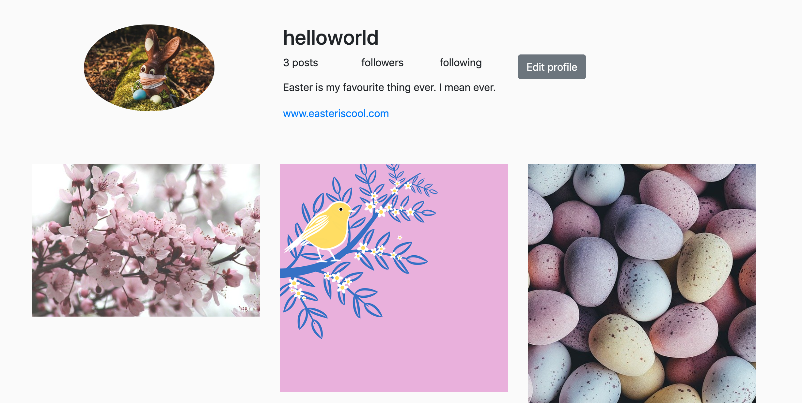

Instagram Challenge
===================

## To run code

```
bundle
rails db:create
rails db:migrate
rails server
```
To add jquery and bootstrap, add them with yarn:
```
yarn add bootstrap jquery popper.js
```
You may also need to install ImageMagick
```
brew install imagemagick
```

## To run tests

Navigate to the main directory and run:

```
rspec
```

## Task

Build Instagram :)

Users should be able to post images, like images, comment on images and have their own profile on the site.

## Domain Model

| Models        | Methods          | State  |
| ------------- |:-------------:| -----:|
| Users    | sign-up, sign-in, log-out , CRUD | email, username, password |
| Posts     | CRUD     |   likes, associated user, caption |
| Comments | CRUD      |    likes, associated user and post |


## Process

1. Created a series of user stories
2. Broke them down into smaller cards, and estimated each card
3. Created domain and database models for a rough project outline
4. Initialized a new rails project and set it up with linting gems.
5. Created an outline feature test, pass and refactor

At several points the process was derailed by styling and hiccups with bootstrap.

Several features were spiked.

## Mockup




## User Stories

First stage for an MVP:

```
As a user,
so I can take part in an image sharing community,
I'd like to be able to register for an account.

As a user,
so I can access my account,
I'd like to be able to login and logout.

As a user,
so I can look at other people's images,
I'd like to be able to view all posts on the site.

As a user,
so I can look at other people's images,
I'd like to be able to see who posted an image.

As a user,
so I can contribute to the website,
I'd like to be able to post an image.

```

Second stage for profile and likes:

```
As a user,
so I can manage my presence on the app,
I'd like to be able to view and edit my own profile.

As a user,
so I can keep track of my posts,
I'd like to see how many posts I've created.

As a user,
so I can promote myself online,
I'd like to be able to include a description and image on my profile.

As a user,
so I can show appreciation for other people's posts,
I'd like to be able to 'like' posts.

```

## Future Additions

* Follower functionality
* Comments functionality
